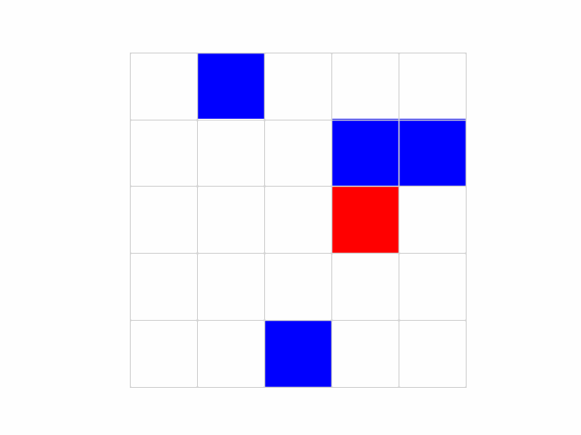
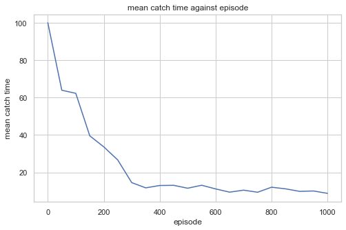
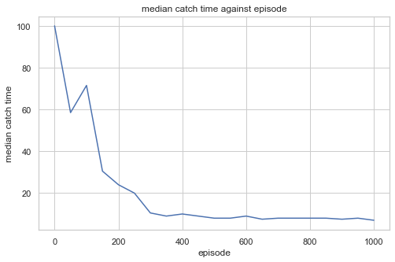
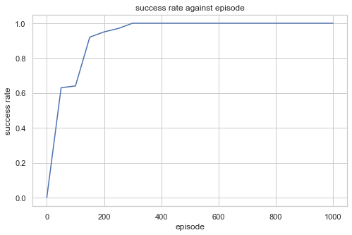

# Deep Q-Learning for Predator Prey
Implementation of the predator prey multi-agent environment and independent DQNs.

Environment description: A toroidal grid world in which 4 predators (blue agents) have to capture a randomly moving prey (red) for a shared reward in 100 time steps.

*Dependency: PyTorch 1.5.0, tensorboardX*

### To train a model for nxn predator prey

`python train.py --cuda --size n --writer log-directory --save model-directory`

`log-directory` and `model-directory` will be created in ./runs and ./models respectively.

### To view training results 

`tensorboard --logdir="runs"`

### Types of training result

1. mean catch time against episode
1. median catch time against episode
1. success rate against episode

(Evaluation is carried out every 50 training episodes by averaging the performance of the models on 100 testing episodes)

### Training result of 5x5 predator prey

### To visualize the trained models in models/5x5

`python visualize.py --size 5 --model models/5x5`